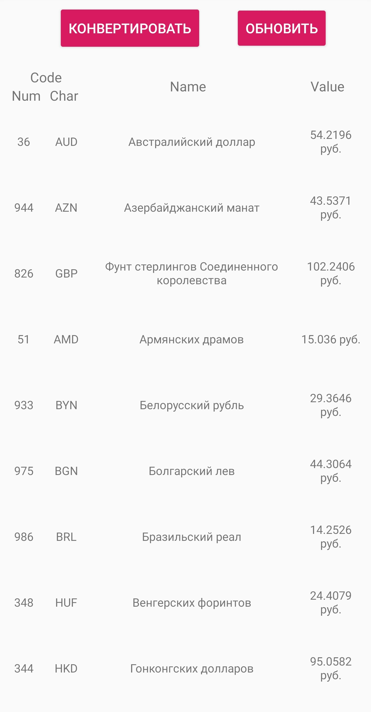

<h1 align="center">Курс валют центробанка + конвертер валют</h1>
<h2 align="center">Описание</h2>
Приложение для получения актуального курса валют центробанка в реальном времени, с возможностью конвертации валют в другие.
<h2 align="center">Работа приложения</h2>
Данные, получаемые с центробанка, обновляются раз в 5 секунд. 

У каждой валюты имеется свое Num - значение, символьное значение, наименование и курс в рублях.

 

Все данные, успешно загруженные ранее, хранятся в бд на устройстве

